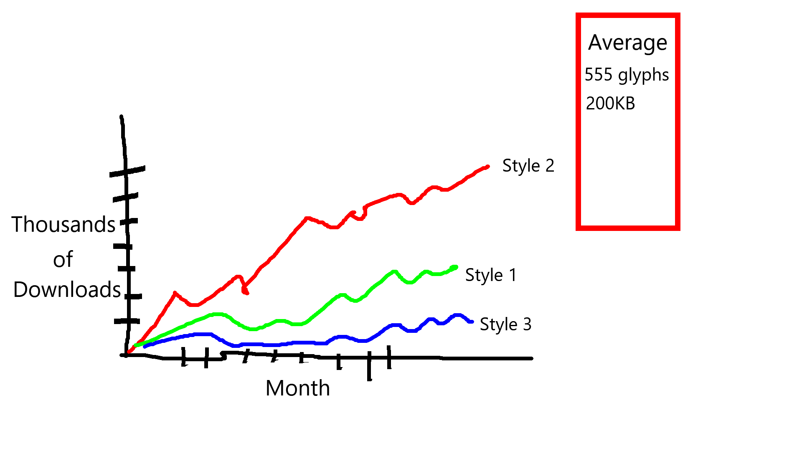
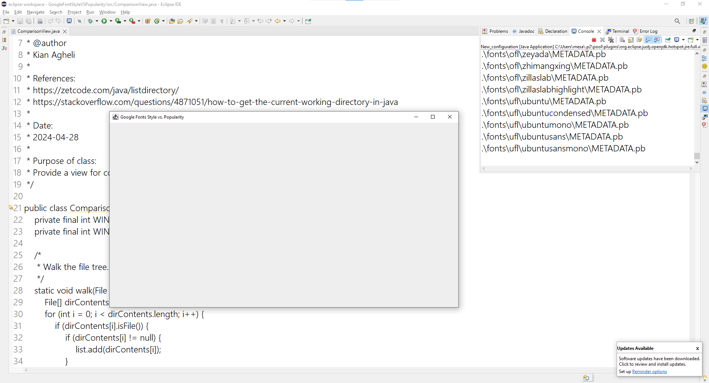

# GoogleFontStyleVSPopularity

## Week 1: Project Proposal

### Planned Working Time

Weekends, afterschool, and Monday and Wednesday mornings before work.

### The Pitch

Google Fonts provides a public-access CDN for typefaces released for use without restriction on commercial use. Setting aside professional opinions on which of the typefaces are worth using, some of the typefaces are downloaded for use on web pages several million times per month. Others are hardly used. Good design isn't an exact science, however there may be tangible, technical qualities which correlate with typeface popularity.

We'd like to graph which styles typefaces are trending in popularity. This way, we may catch on to the typographic trend without using the exact same typeface that is used everywhere else.

Google Fonts provides two databases publicly. https://raw.githubusercontent.com/google/fonts/main/tags/all/families.csv provides a listing of each typeface's name; style; and weight. https://fonts.google.com/metadata/stats provides popularity statistics of each typeface, over different metrics of time. Together, these may be used to generate a graphical interface demonstrating what correlation, if any, lies between a typeface's technical qualities and actual popularity. The typefaces are downloadable from a central repository, https://github.com/google/fonts. Using the files included, lower-level properties, such as glyph count and file size, may be analyzed.

#### Mockup

A graph, with the Y axis tracking downloads and the X axis tracking time. Each line in the graph represents a style. Each line may be clicked on for details.

#### CRC

### UML

### Video

https://mesacsclub.com/kaa/explain.mp4

### Learning Outcomes
LO1: Employ design principles of object-oriented programming
* Each typeface is represented as an object.

LO2: Construct programs utilizing single and multidimensional arrays
* Array of styles containing arrays of typefaces.

LO3: Construct programs utilizing object and classes in object-oriented programming, including aggregation
* ComparisonView has-an array of FontFamilies.

LO4: Construct programs utilizing inheritance and polymorphism, including abstract classes and interfaces
* CSVReader and JSONReader extend Reader. Comparisonview Extend JFrame.

LO5: Construct programs using generic collections and data structures
* I might use ArrayLists instead of arrays for the set of FontFamilies.

LO6: Construct programs utilizing graphical user interfaces utilizing event-driven programming.
* Line graph with interactive elements. Each line may be clicked on for further information.

LO7: Construct programs utilizing exception handling
* Check each file's location in the HashMap. If permissions fail, handle it, notify the user.

LO8: Construct programs utilizing text file I/O
* Reader reads from CSV and JSON.

### The Plan

#### Week 1

* GUI mock-up
* CRC cards
* UML
* Video explanation
* This timeline

#### Week 2
* Start method stubs
* Start GUI

#### Week 3

* Start parsing CSV
* Javadoc in advance as much as is pragmatic

#### Week 4

* Start parsing JSON
* Write objects which represent each font
* Figure out API calls for file size and glyph count

#### Week 5

* Start writing methods to calculate trends over time
* Line graph of top styles
* Check documentation as it exists

#### Week 6

* Update databases
* Finalize trend calculation methods

#### Week 7
* re-structure as needed

#### Week 8

* Whatever isn't done, finish it
* Demonstration video

## Week 2: Updates
The design implementation has been begun.
Method stubs have been put in place.
The start of the file searching has been implemented.

The metadata of each file family is stored in a METADATA.pb in its
associated directory. From this, we get the human name, the names of
all associated font files, and a few other pieces of information.
In main(), we walk the file tree, looking for all METADATA.pb files.
These will in turn be allocated JSONReader objects. JSONReader will
tentatively allow for pulling fields from the file similar to jq.
Processing that kind of syntax requires recursive descent through braces,
I'm mentally preparing myself to write that kind of code.

Current output: a listing of the METADATA.pb file paths.
.\fonts\apache\aclonica\METADATA.pb
...
.\fonts\ofl\zenloop\METADATA.pb
.\fonts\ofl\zenmarugothic\METADATA.pb
.\fonts\ofl\zenoldmincho\METADATA.pb
.\fonts\ofl\zentokyozoo\METADATA.pb
.\fonts\ofl\zeyada\METADATA.pb
.\fonts\ofl\zhimangxing\METADATA.pb
.\fonts\ofl\zillaslab\METADATA.pb
.\fonts\ofl\zillaslabhighlight\METADATA.pb
.\fonts\ufl\ubuntu\METADATA.pb
.\fonts\ufl\ubuntucondensed\METADATA.pb
.\fonts\ufl\ubuntumono\METADATA.pb
.\fonts\ufl\ubuntusans\METADATA.pb
.\fonts\ufl\ubuntusansmono\METADATA.pb

CSV files have a header and a body. The header is one line.
The body is every line after. Maybe the body should be composed
of an array of hash maps? Or would an array of arrays of Strings
suffice?

Graphically, only a window has been created. It now needs
to be populated with widgets. I've got to figure out the details of the
line graph implementation before the visuals are put in place.

Due to the size of the google fonts repository, it may be difficult
to share this project. As a whole, it's about 4GB. The vast majority
of that is font data. I'll provide a zip file with a subset of these
families included. To get the whole thing, clone from github.

## Week 3
Repository re-organized. Font family metadata saved, all outline font files removed.
